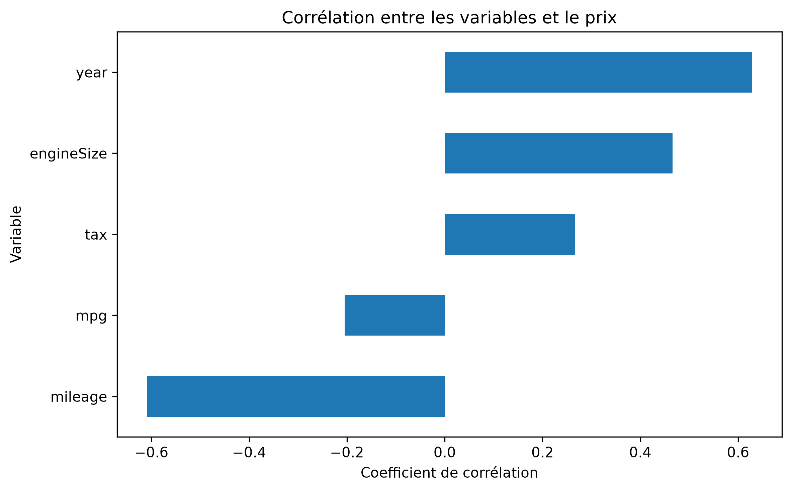
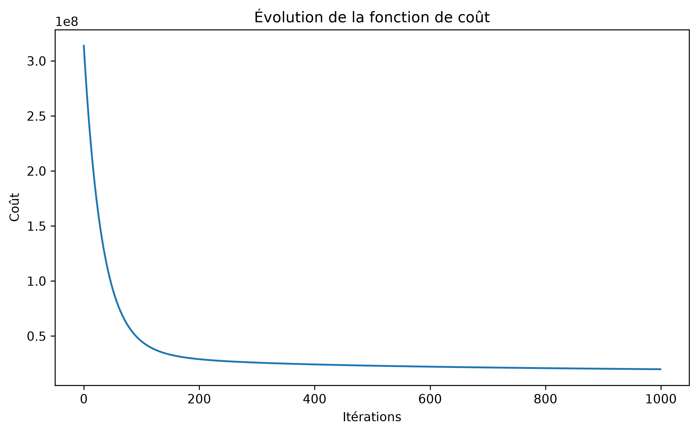
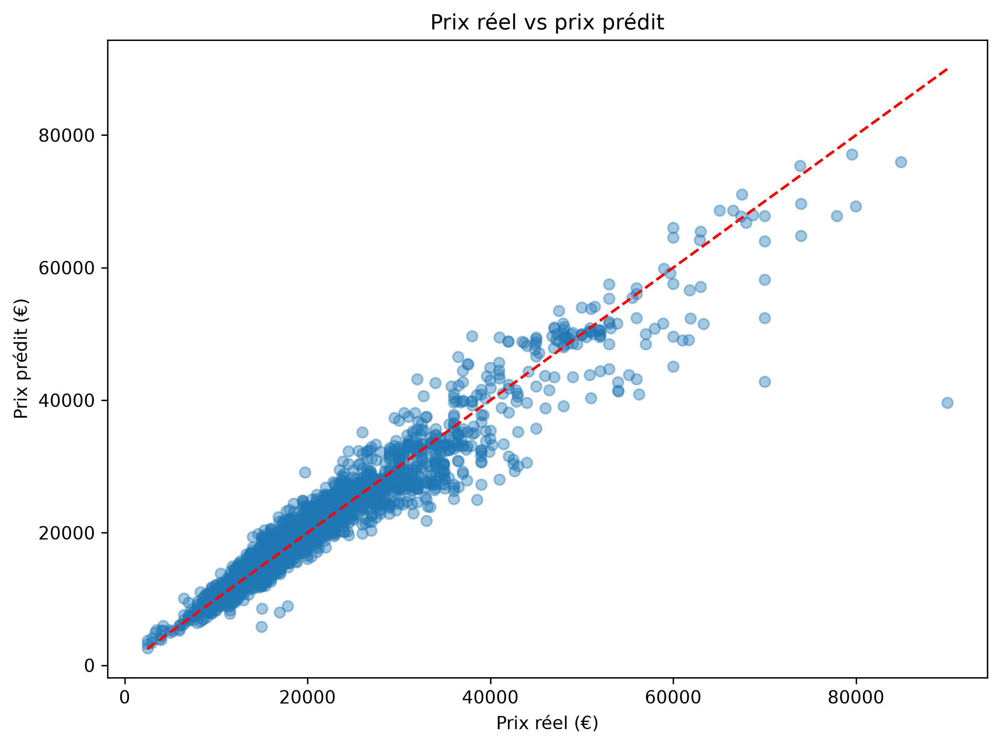

# 🚗 BMW Value Predictor

Machine Learning project for predicting the price of a used BMW from its main characteristics.

The project was developed as a practical project after completing the first course of Andrew Ng's Machine Learning specialization.

---

## 🎯 Project Objective

The objective of this project is to build a Machine Learning model capable of estimating the price of a used BMW based on:

- BMW model
- Year
- Mileage
- Transmission
- Fuel type
- Tax
- MPG
- Engine size

The project follows a complete Machine Learning workflow:

**Data → Cleaning → Preprocessing → Feature Scaling → Training → Evaluation → Prediction → Web Application**

---

## 📊 Dataset

The dataset contains information about used BMW vehicles.

### Dataset size

**Original dataset:**

- 10,781 observations
- 9 variables

**After data cleaning:**

- 10,651 observations
- 9 variables
- 117 duplicate rows removed
- Invalid price removed
- Invalid `engineSize = 0` values removed when they were not associated with BMW i3 vehicles

### Main variables

| Variable | Description |
|---|---|
| `model` | BMW model |
| `year` | Manufacturing year |
| `price` | Vehicle price |
| `transmission` | Transmission type |
| `mileage` | Mileage |
| `fuelType` | Fuel type |
| `tax` | Vehicle tax |
| `mpg` | Fuel consumption |
| `engineSize` | Engine size |

---

## 🧹 Data Preprocessing

Several preprocessing steps were applied before training the model.

### 1. Data cleaning

The following cleaning operations were performed:

- Removed duplicate observations
- Removed the anomalous price `123456`
- Removed invalid zero engine sizes except for BMW i3 vehicles
- Cleaned model names using `strip()`

### 2. Categorical variables

Categorical variables were transformed using **One-Hot Encoding**:

- `model`
- `transmission`
- `fuelType`

### 3. Numerical variables

Numerical variables were standardized using **StandardScaler**:

- `year`
- `mileage`
- `tax`
- `mpg`
- `engineSize`

The final dataset contains **34 features** after encoding.

---

## 🤖 Machine Learning Model

The final model is a **Linear Regression** model.

Because BMW prices are right-skewed, the model was trained on the logarithm of the target variable.

### Logarithmic target transformation

```python
y_train_log = np.log(y_train)
```

After prediction, the result is converted back to the original price scale:

```python
predictions = np.exp(predictions_log)
```

This approach significantly improved the model compared with directly predicting the price.

---

## 📈 Model Evaluation

The dataset was divided into:

- 80% training data
- 20% test data

The final model achieved:

| Metric | Result |
|---|---|
| MAE | 2,074.57 € |
| RMSE | 3,199.04 € |

### Model comparison

A standard Linear Regression model without the logarithmic transformation obtained approximately:

| Model | MAE | RMSE |
|---|---|---|
| Linear Regression | 2,775.62 € | 4,038.78 € |
| Linear Regression + Log Target | 2,074.57 € | 3,199.04 € |

Using the logarithm of the target improved both evaluation metrics.

---

## 📊 Visualizations

### Correlation analysis

The following visualization shows the relationships between the numerical variables and the BMW price.



### Cost function

The cost function decreases during Gradient Descent, showing that the algorithm progressively minimizes the prediction error.



### Predictions

This visualization compares the actual BMW prices with the prices predicted by the Machine Learning model.



---

## 🖥️ Streamlit Application

The project includes an interactive web application developed with Streamlit.

The user can enter:

- BMW model
- Year
- Mileage
- Transmission
- Fuel type
- Tax
- MPG
- Engine size

The application then returns an estimated BMW price.

### Run the application

From the project root:

```bash
streamlit run app/app.py
```

The application will open in the browser.

---

## 📁 Project Structure

```text
BMW-Value-Predictor/
│
├── app/
│   ├── app.py
│   └── assets/
│       └── bmw_logo.png
│
├── data/
│   └── bmw.csv
│
├── images/
│   ├── correlation.png
│   ├── cost_function.png
│   └── predictions.png
│
├── models/
│   └── bmw_model.pkl
│
├── notebooks/
│   └── BMW_Price_Prediction.ipynb
│
├── src/
│   ├── preprocessing.py
│   ├── cost_function.py
│   ├── gradient_descent.py
│   ├── prediction.py
│   ├── train_model.py
│   └── test_preprocessing.py
│
├── .gitignore
├── requirements.txt
└── README.md
```

---

## ⚙️ Installation

### 1. Clone the repository

```bash
git clone https://github.com/TahtatMoussa/BMW-Value-Predictor.git
```

### 2. Navigate to the project

```bash
cd BMW-Value-Predictor
```

### 3. Create a virtual environment

```bash
py -m venv .venv
```

### 4. Activate the virtual environment

On Windows:

```bash
.venv\Scripts\activate
```

### 5. Install dependencies

```bash
pip install -r requirements.txt
```

### 6. Run the application

```bash
streamlit run app/app.py
```

---

## 📦 Technologies

- Python
- NumPy
- Pandas
- Matplotlib
- Scikit-learn
- Streamlit
- Joblib
- Jupyter Notebook
- Git / GitHub

---

## 🧠 Machine Learning Concepts Used

This project allowed me to apply the following concepts:

- Supervised Learning
- Linear Regression
- Cost Function
- Gradient Descent
- Feature Scaling
- One-Hot Encoding
- Train/Test Split
- Model Evaluation
- Mean Absolute Error (MAE)
- Root Mean Squared Error (RMSE)
- Logarithmic target transformation
- Model serialization with Joblib

---

## 🚀 Future Improvements

Possible improvements include:

- Testing more advanced regression models
  - Random Forest
  - Gradient Boosting
  - XGBoost
- Hyperparameter optimization
- Cross-validation
- Better handling of outliers
- Improved prediction intervals
- Deployment of the Streamlit application

---

## 👨‍💻 Author

**Moussa Tahtat**

Bachelor 3 — Intelligence Artificielle  
ECE Paris
